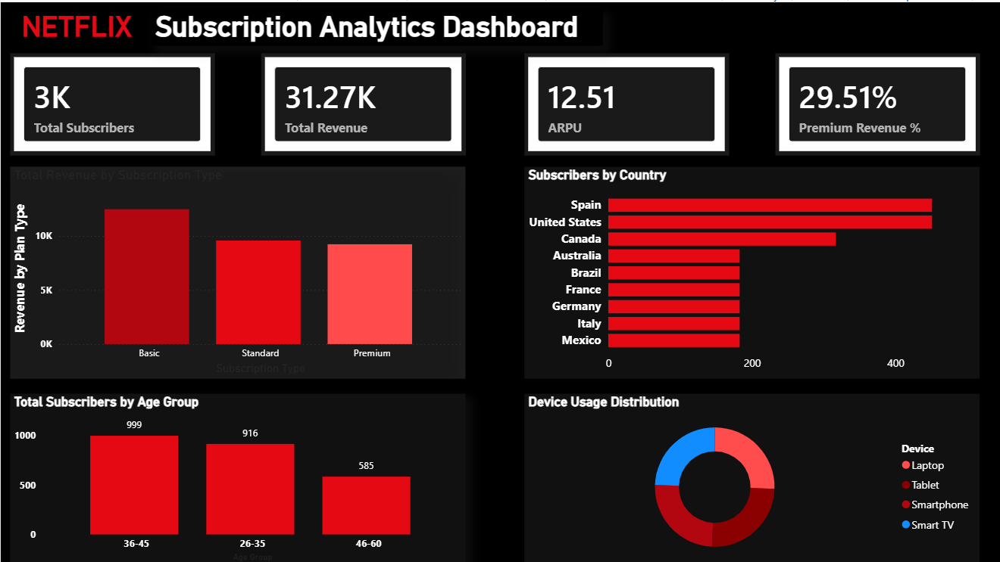

# Netflix Subscription Analytics Dashboard

## Overview
Interactive Power BI dashboard analyzing Netflix subscription trends, revenue distribution, device usage, and demographics.

## Tools Used
- Power BI
- DAX
- Data Cleaning
- Data Visualization

## Key Metrics
- 3K Subscribers
- $31.27K Revenue
- 12.51 ARPU
- 9 Countries Analyzed

## Dashboard Features
- Revenue by Subscription Type
- Subscribers by Country
- Age Group Analysis
- Device Usage Distribution
- KPI Tracking

## Key Insights
- Spain and the US lead in subscriber count
- 36–45 age group contributes most subscribers
- Smartphones and laptops dominate viewing habits

## Dashboard Preview

## Project Video
A short dashboard walkthrough video is included in this repository.
